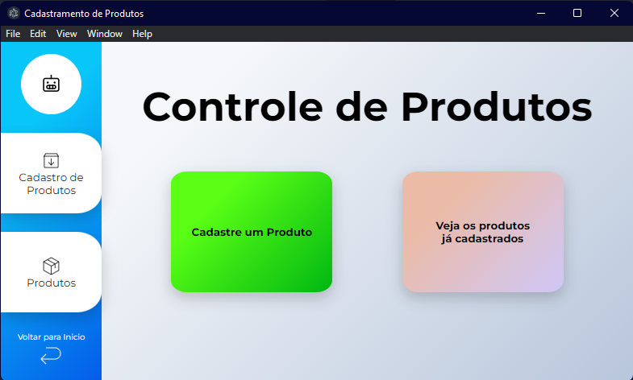

# electron-challenge

Olá, está é uma aplicação de cadastro de produtos desenvolvida em ReactJS, MongoDB Electron utilizando Typescript. É chamada "electron-challenge" e foi um teste prático para uma vaga de estágio de implementação de RPA.

É o meu primeiro projeto envolvendo as duas tecnologias (tanto ReactJS como Electron) então o processo foi bastante divertido e houve bastante aprendizado.

A divisão das pastas estão na seguinte lógica: dentro de UI estará a pasta "COMPONENTS" (que são os componentes que cada página utilizará para criar suas respectivas formas) e também a pasta PAGES (que são as páginas/arquivos que a aplicação terá, são construidas a base dos componentes, como se fosse um lego!). Para a navegação de páginas foi utilizado a biblioteca "react-router-dom". Para obter os dados do formulário de cadastro, foi utilizado uma comunicação de processos (ipcRenderer e ipcMain).

A aplicação no momento está restrita ao tamanho 800x500. A aba de "Produtos" não está 100% estilizada mas tá funcional! :) 

# Como inicializar essa aplicação:

1. Utilize o comando "yarn" para baixar as dependencias.
2. Utilize o comando "yarn dev" para iniciar a aplicação.

Qualquer dúvida pode me chamar no discord jonatha#0261 :) 

